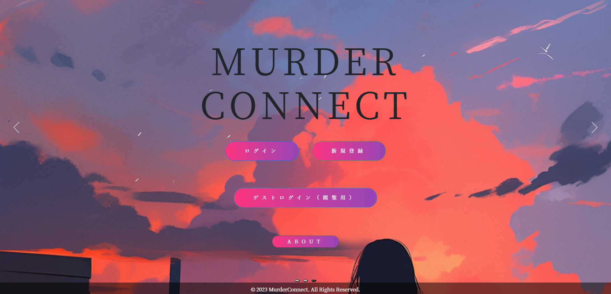

# <マーダーコネクト>

## サイト概要
マーダーミステリーを遊ぶ人たちがつながりやすいように
色んな作品に触れやすくなることが目的です。

### サイトテーマ
分類：その他
マーダーミステリーをやっている人とつながるサイト

### テーマを選んだ理由
マーダーミステリーを遊んでいくうえで参加したい作品のGMを探すのがとても大変だったからです。
またGMをやりたいと考えてもPLの方を募集することが難しく、PLとして参加する際もGMの方を探すことが困難だったため
需要と供給が一致すると考えたためです。

### ターゲットユーザ
マーダーミステリーを行っているユーザー全般です。
・GMをやりたいのにPLが見つけれない方
・PLとして参加したいのにGMが見つからない方
が対象です

### 主な利用シーン
マーダーミステリーを行いたくてGM・PLを探しているときに利用します。
GM側のユーザーは回せるシナリオの一覧を作成しその中でも依頼を受け付ける作品を分けて表示します。
回すシナリオの中でもどれだけ自信があるかBGMにこだわっているかの項目を書き込むことが出来ます。
またGM可能な日付をカレンダー形式orテキスト形式で表示しPL側が依頼する日を検討しやすいようにします。

PL側のユーザーは野良で参加したい作品には野良で参加希望を出せるようにします。
団体で申し込みを行いたい場合には団体で申し込めるような設定にします。
通過リストを作成、編集可能。通過したいリストも作成できます。
どれだけのユーザーがやっているのか確認もできます。

そして全体としてGM評価、PL評価を作成することができ同卓したい人かどうかの判断をできるようにします。

## 設計書
<!--テーマを設定・提出する時点では不要です-->
* [実装機能リスト](https://docs.google.com/spreadsheets/d/1dOZ9sZdcn1sfbSDiRSGBEDb7NU5NvtZCuASVBHlNO-I/edit#gid=375590402)
* [ER図](https://drive.google.com/drive/u/0/folders/1mOovUd6HTQoZ35piqrLUDKZOyvoiMZ7k)
* [画面遷移図](https://app.diagrams.net/#G1q4wyp7PAp4YR3JXTsKvSg3eMJFGpz3yv)
* [アプリケーション詳細設計](https://docs.google.com/spreadsheets/d/1oxRnshCmzzMD814biUJmEFZyzwCdlRsrXH2Gcgdm4Es/edit#gid=549108681)
* [WBS](https://docs.google.com/spreadsheets/d/1C279SB1955XokRmm4FayT0NI8iI6LZWDaMA6BWQlbww/edit#gid=977420151)
* [テスト仕様書](https://docs.google.com/spreadsheets/d/1JwJ97i4qHRcq_i5tWS6AejJOkOd4UTw_/edit?usp=drive_link&ouid=113453578625944975769&rtpof=true&sd=true)
## 開発環境
- OS：Linux(CentOS)
- 言語：HTML,CSS,JavaScript,Ruby,SQL
- フレームワーク：Ruby on Rails
- JSライブラリ：jQuery
- IDE：Cloud9
​

## 使用素材
- BOOTHに使用されている作品の画像が使用出来たらと思っています（著作権上問題があるならばタイトルだけにします）